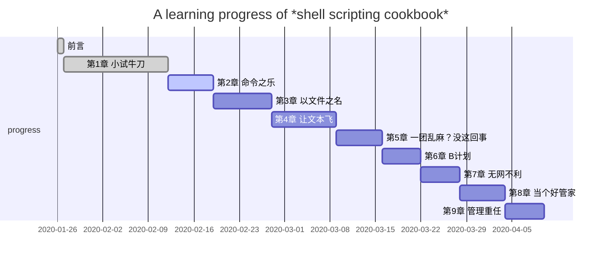

# Learn *shell scripting cookbook*

## Books

1. [LINUX SHELL脚本攻略(中文版带书签).pdf](./LINUX SHELL脚本攻略(中文版带书签).pdf)
2. [Linux Shell Scripting Cookbook, 2nd Edition.pdf](./Linux Shell Scripting Cookbook, 2nd Edition.pdf)

   

## Plan

## Reference

